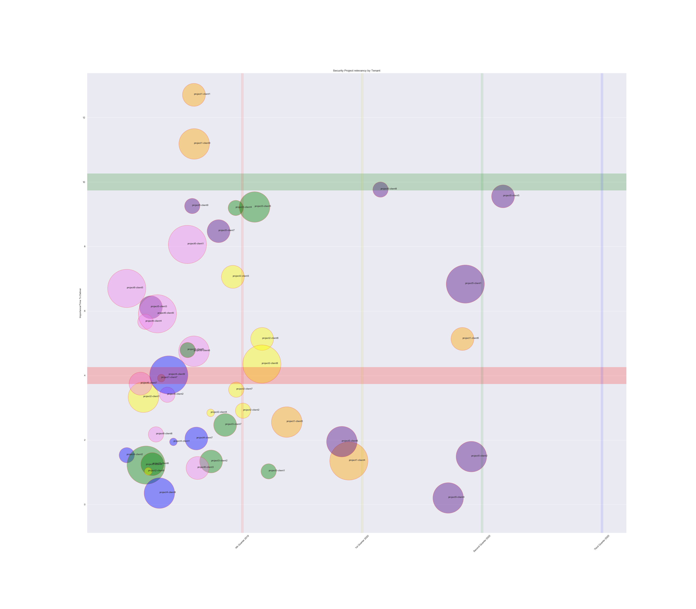

# Project Scoring System

 This project allows you to take a series of projects that need to be applied to a series of clients and visualize what the most valuable projects look like. 

## Simple overview

- Copy the .csv file, replace your projects with your current project names without spaces
- replace the clients with your current client list

Then score:
- Initiative Score: Managers/Leaders should rank rach Project in relation to business objectives
- Time Score Managers/Leaders/Project Managers should agree on when those projects have been committed to their Client (by quarter, project, week, etc)
- SMEs and individual engineers offer a grade of complexity or reworkability into the Project tech (do I make one change that's easy from our current process, or do I have to rewrite all the configs for each client, making each config more complex)

*Then score each intersection* 
- How important to Client A is Project 1? 0 means 'not at all', then 1-5.
- Each score can be fudged in order nudge Clients/Projects that don't fit in well higher or lower. 

Save these, then import into the Notebook and generate your graph. 

## How to interpret the Visualization

#### *For the current sprint intake*
- Focus on anything in the upper left area, above the green line
- Then focus on anything above the red line
- Big circles mean 'more complex' and probably need more engineers or more commitment.

#### *Confirm that anything below the Red Line can be dropped on the floor*
- if you can't assign engineers to the items that require review, realize that you spend the fewest number of resources to these items. Drop them if possible

#### *Use items further right on the y-axis as upcoming requirements*
- This will require rescoring to ensure that the needs stay fresh
- have conversations to find anything that stays below the red line for more than a quarter/sprint/etc. 

TODO:
- fix legend
- make it easier to color by Project or Client
- Add Story Points
- Add hooks for JIRA and Trello
- Add import or export to database

## Output Image

